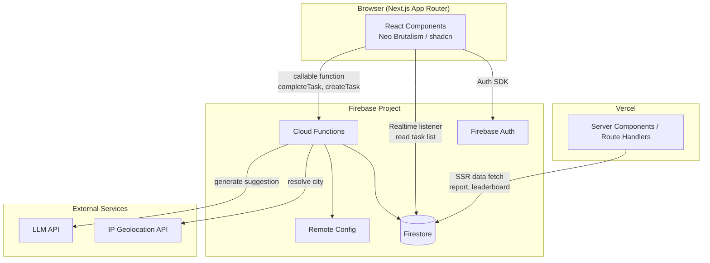
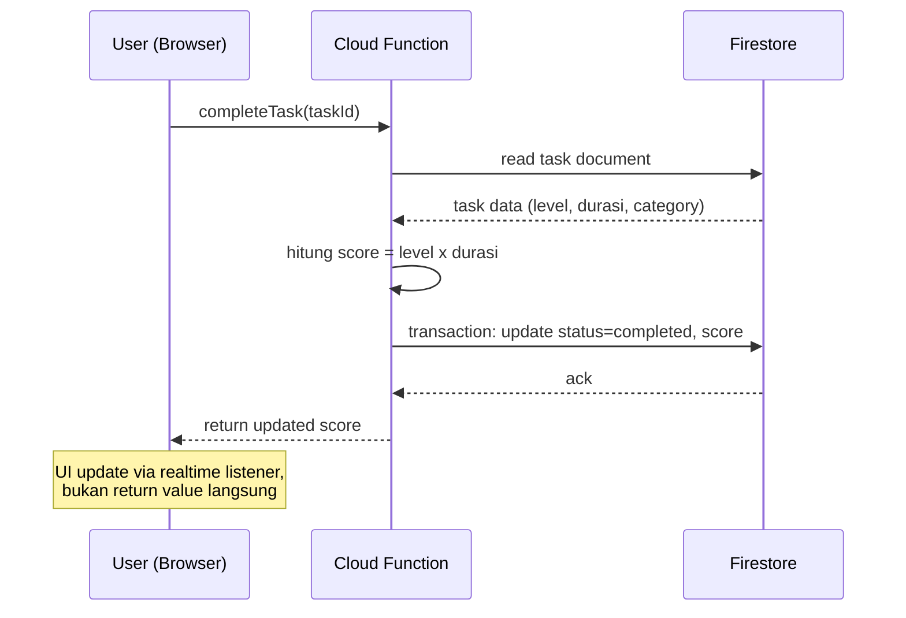

# Architecture Document

## 1. Architecture Style

BaaS-centric architecture: Next.js sebagai frontend (App Router, di-deploy ke Vercel) berkomunikasi langsung dengan Firebase services untuk sebagian besar operasi (read realtime, auth), dan lewat Cloud Functions untuk operasi yang butuh business logic terpusat atau scheduled job.

**Kenapa bukan custom backend (Express/Nest di server terpisah)**: scope aplikasi ini (CRUD task, scoring, report, leaderboard) tidak butuh backend server yang selalu hidup. Firestore + Cloud Functions cukup menghandle seluruh business logic tanpa perlu maintain server terpisah, mengurangi operational overhead. Trade-off: vendor lock-in ke Firebase lebih tinggi dibanding custom backend, tapi untuk tim kecil/solo project ini adalah trade-off yang wajar diambil demi development speed.

**Kenapa hosting Next.js di Vercel, bukan Firebase Hosting**: Firebase Hosting punya integrasi Next.js tapi dukungan untuk App Router (server components, streaming, ISR) masih lebih terbatas dibanding Vercel yang memang dibuat oleh tim Next.js. Cloud Functions tetap jalan di Firebase project terlepas dari di mana frontend di-host, jadi tidak ada downside signifikan memisahkan hosting frontend dari backend. Ini assumption yang saya ambil karena tidak dinyatakan eksplisit sebelumnya — kalau ada constraint organisasi yang mengharuskan semua di Firebase (misal budget/billing tunggal), beri tahu saya dan bagian deployment perlu direvisi.

## 2. High-Level System Diagram



## 3. Frontend Architecture (Next.js)

### 3.1 Routing Structure

```
app/
  (auth)/
    login/page.tsx
    register/page.tsx
  (app)/
    layout.tsx              -> shared nav, auth guard
    home/page.tsx
    report/page.tsx
    leaderboard/page.tsx
    profile/page.tsx
```

Route group `(app)` pakai layout yang melakukan auth check di server component (redirect ke `/login` kalau belum authenticated). Route group `(auth)` terpisah supaya tidak kena layout yang sama.

### 3.2 Server vs Client Components

| Konten | Tipe | Alasan |
|---|---|---|
| Task list (home) | Client | Butuh realtime update (`onSnapshot`) saat task ditambah/completed |
| Daily/weekly report | Server Component (initial fetch) + client untuk interaksi kecil | Data report tidak perlu realtime, cocok di-fetch di server untuk mengurangi client bundle dan loading state |
| Leaderboard table | Server Component | Data hanya berubah di akhir minggu, tidak perlu realtime listener yang menghabiskan koneksi Firestore |
| Profile form | Client | Interaktif (edit form, upload avatar) |

Prinsip umum: default ke Server Component, turun ke Client Component hanya kalau butuh interaktivitas atau realtime data. Ini mengurangi JS yang dikirim ke browser dibanding all-client-side SPA pattern.

### 3.3 State Management

- **Realtime data** (task list hari berjalan): custom hook di atas Firestore `onSnapshot`, di-wrap sebagai `useTasks(date)`. Tidak butuh state management library tambahan karena Firestore SDK sudah handle subscription lifecycle.
- **Non-realtime data** (report, leaderboard): fetch di server component, atau kalau butuh client-side refetch/cache gunakan SWR tipis di atasnya. Tidak perlu React Query penuh untuk scope ini.
- **Global UI state** (modal open/close, toast, theme): Zustand, single small store. Redux ditolak karena overkill untuk state yang sesimpel ini — akan menambah boilerplate tanpa benefit nyata di skala aplikasi ini.

## 4. Backend Architecture (Firebase)

### 4.1 Kenapa Task Completion Tidak Ditulis Langsung dari Client

Task completion menghasilkan skor, dan skor punya business rule yang cukup kompleks (level x durasi, per-task cap, daily aggregate cap 24 jam). Kalau logic ini hanya divalidasi lewat Firestore Security Rules, ada dua masalah:

1. Security rules tidak bisa dengan mudah melakukan aggregate query (menjumlahkan durasi semua task di tanggal yang sama) untuk validasi cap harian.
2. Logic scoring akan tersebar: sebagian di client (untuk UX, preview skor), sebagian di rules (untuk enforcement). Kalau formula berubah, harus diubah di dua tempat.

**Keputusan**: task completion dan creation yang mempengaruhi skor melalui **Cloud Functions callable function**, bukan direct Firestore write dari client.

- `createTask(input)`: validasi input, cek daily aggregate cap (query task existing di tanggal sama dalam Firestore transaction), simpan task dengan status `pending`.
- `completeTask(taskId)`: hitung skor dari level x durasi, update status jadi `completed`, tulis skor final. Dilakukan di Cloud Function pakai Admin SDK sehingga security rules bisa deny direct write ke field `status` dan `score` dari client sama sekali.

Firestore Security Rules jadi sederhana: user hanya boleh read task miliknya sendiri, dan create/update terbatas ke field non-sensitif (title, misal saat masih pending). Semua mutasi yang berhubungan dengan skor lewat Cloud Function.

### 4.2 Scheduled Cloud Functions

| Function | Trigger | Tanggung Jawab |
|---|---|---|
| `taskCutoverJob` | Cloud Scheduler, tiap jam | Cari user yang local midnight-nya jatuh di jam tersebut (berdasarkan timezone tersimpan di profile), transisi task `pending` mereka yang sudah lewat tanggalnya jadi `missed` |
| `weeklyCycleJob` | Cloud Scheduler, **fixed cron global** (default `0 0 * * 1` — Senin 00:00 UTC) | 1) Hitung weekly report tiap user (balance index, completion rate). 2) Jalankan leaderboard matching (city -> province fallback). 3) Hitung leaderboard score tiap grup. 4) Assign badge top 3. 5) Generate rule-based suggestion, trigger AI enhancement kalau enabled |

**Kenapa global UTC, bukan per-timezone user seperti `taskCutoverJob`**: satu grup leaderboard berisi user dari kota/provinsi berbeda yang bisa saja beda timezone. Kalau batas minggu per-user, dua anggota grup yang sama bisa punya window kompetisi yang tidak sinkron (user A minggu-nya sudah tutup, user B masih jalan) — ini merusak fairness leaderboard. Batas minggu untuk seluruh sistem harus satu titik waktu global. Cron time-nya sendiri fixed di deploy time (Cloud Scheduler tidak bisa baca Remote Config secara real-time untuk menentukan kapan trigger jalan), beda dengan konstanta weighting yang memang bisa di-tune lewat Remote Config karena dibaca saat function dieksekusi, bukan saat menentukan kapan function di-trigger.

**Kenapa hourly job untuk task cutover, bukan per-menit atau strictly per-user real time**: presisi ke menit tidak dibutuhkan untuk use case "hari berakhir" — toleransi delay hingga ~1 jam masih acceptable secara produk. Hourly job jauh lebih murah dan simpel dibanding scheduling per-user yang presisi ke detik, yang butuh infrastruktur seperti Cloud Tasks per-user schedule (overkill untuk kebutuhan ini).

### 4.3 Remote Config untuk Tunable Constants

Constants berikut ditaruh di Firebase Remote Config, di-fetch oleh Cloud Functions (server-side, bukan client) supaya bisa di-tune tanpa redeploy dan tidak bisa dibaca/dimanipulasi dari browser:

- `dailyDurationCapHours` (default 24)
- `perTaskDurationCapHours` (default 16) — flat cap, sama untuk hustle maupun humble (`PRD.md` Section 5.2)
- `balanceWeightFloor`, `balanceWeightRange` (default 0.5, 0.5)
- `completionWeightFloor`, `completionWeightRange` (default 0.5, 0.5)
- `aiReportEnabled` (global kill switch, terpisah dari per-user setting di profile)

### 4.4 External Service Abstraction

Baik IP geolocation maupun LLM API dipanggil lewat interface tipis di dalam Cloud Functions (`services/geolocation.ts`, `services/aiSuggestion.ts`), bukan dipanggil langsung dari business logic. Tujuannya supaya provider bisa diganti (misal pindah dari ip2location.io ke provider lain, atau ganti LLM provider) tanpa mengubah kode di `weeklyCycleJob`. Untuk MVP, provider yang direkomendasikan:

- **IP Geolocation**: [ip2location.io](https://www.ip2location.io), dipilih sesuai keputusan. Catatan yang mempengaruhi implementasi:
  1. **Free plan (dengan API key) memberi 50.000 query/bulan**, HTTPS didukung (beda dari ip-api.com yang sempat dipertimbangkan sebelumnya dan HTTP-only di free tier). Tanpa API key (keyless), limitnya jauh lebih kecil (1.000 query/hari) — jadi **wajib register dan pakai API key** dari awal, bukan pakai endpoint keyless.
  2. **Tidak ditemukan larangan eksplisit commercial use** di free plan seperti ip-api.com, tapi ini belum saya verifikasi langsung ke Terms of Service resmi mereka — sebelum production launch, baca ToS lengkap untuk memastikan penggunaan di produk yang (berpotensi) komersial tidak melanggar ketentuan free plan.
  3. **Free plan berhenti total saat quota bulanan habis** (bukan throttle/degrade, tapi hard stop sampai reset bulan berikutnya). Ini beda karakter risiko dari ip-api.com yang throttle per-menit: di sini risikonya adalah kehabisan quota di pertengahan bulan kalau user base tumbuh cepat. Karena resolve city cuma dilakukan sekali per user per weekly cycle (bukan tiap request), 50.000/bulan cukup untuk kira-kira 12.000 user aktif per minggu (asumsi 4-5 weekly cycle per bulan) — cukup generous untuk MVP, tapi perlu monitoring quota usage dan alert sebelum mendekati limit, supaya tidak tiba-tiba semua resolve city gagal di tengah `weeklyCycleJob`.
  4. **Fallback saat quota habis**: `weeklyCycleJob` harus punya graceful degradation — kalau geolocation call gagal karena quota habis, user tersebut sebaiknya dilewati dari matching cycle minggu itu (bukan bikin seluruh job gagal), dan dicatat untuk di-retry atau diberi notifikasi supaya isi city manual sebagai override sementara.

  Provider tetap dipanggil lewat abstraction layer (`services/geolocation.ts`) supaya bisa pindah provider lain kalau limitasi di atas jadi blocker nyata.
- **AI suggestion**: dipanggil lewat Anthropic API atau provider lain, dengan timeout ketat (misal 10 detik) dan fallback otomatis ke rule-based suggestion kalau call gagal atau timeout. Report tidak boleh gagal total hanya karena AI enhancement bermasalah.

## 5. Authentication Flow

1. User memilih login method: email/password atau OAuth (Google, GitHub, X).
2. Firebase Auth SDK menghandle flow di client (popup/redirect untuk OAuth).
3. Setelah berhasil, `onAuthStateChanged` listener di root layout menyimpan auth state.
4. **First-time login**: cek apakah dokumen user profile sudah ada di Firestore (`users/{uid}`). Kalau belum, buat dokumen baru dan minta user melengkapi city (untuk kasus IP geolocation gagal) serta auto-detect timezone lewat `Intl.DateTimeFormat().resolvedOptions().timeZone` di client, dikirim sekali saat onboarding.
5. Server Component untuk halaman terproteksi memverifikasi session lewat Firebase Admin SDK (session cookie, bukan hanya client-side ID token) supaya SSR bisa tahu status auth sebelum render.

**Catatan teknis X (Twitter) OAuth**: provider ID di Firebase Auth SDK saat ini masih `twitter.com` (legacy naming). Perlu dicek ulang saat implementasi apakah SDK versi yang dipakai sudah ada perubahan, karena X sudah lama rebrand dari Twitter.

## 6. Data Flow: Task Completion (Detail)



## 7. Security Architecture

- **Firestore Security Rules**: default deny. User hanya bisa read dokumen milik sendiri (task, report, badge). Write ke field `score`, `status: completed`, dan seluruh koleksi `leaderboard`/`badges` ditolak dari client — hanya Admin SDK (Cloud Functions) yang bisa menulis field tersebut.
- **Secrets**: API key untuk IP geolocation dan LLM provider disimpan di Cloud Functions environment config / Secret Manager, tidak pernah di-expose ke client bundle.
- **Rate limiting**: callable functions (`createTask`, `completeTask`) perlu app check (Firebase App Check) untuk mencegah abuse dari luar aplikasi resmi (bukan hanya mengandalkan auth token).

## 8. Keputusan atas Open Items dari PRD Section 14

| Item PRD | Keputusan |
|---|---|
| Konstanta formula weighting leaderboard | Ditaruh di Remote Config (Section 4.3), bukan hardcoded |
| Timezone handling task cutover | Timezone disimpan per-user di profile, hourly scheduled job (Section 4.2) |
| IP geolocation provider | ip2location.io (free plan, 50.000 query/bulan dengan API key) untuk MVP, di belakang service abstraction (Section 4.4). Verifikasi ToS commercial use sebelum production launch |
| Manual override city | **In scope** untuk MVP. Field city di profile settings bisa di-edit manual, override hasil IP geolocation. Alasan: implementasi murah (satu field form), langsung mengurangi risiko kompensasi user kalau IP geolocation salah deteksi |

## 9. Scalability Considerations

- Leaderboard grouping (14 user per grup) berarti query harus di-partition per grup, bukan scan seluruh koleksi user. Struktur data grup leaderboard didesain sebagai sub-collection per cycle, detail di `DATABASE.md`.
- Firestore composite index dibutuhkan untuk query task by `userId + date` dan `userId + status`.
- `weeklyCycleJob` yang memproses seluruh user sekaligus berpotensi jadi bottleneck kalau user base besar. Untuk MVP, jalankan sebagai satu batched function dengan pagination (proses N user per batch). Kalau user base tumbuh signifikan, pertimbangkan pecah jadi task queue (Cloud Tasks) per user/grup.

## 10. Testing Strategy (Ringkas)

- Cloud Functions (business logic scoring, cap validation, balance formula): unit test dengan Firebase Emulator Suite, karena ini bagian paling kritis untuk correctness dan paling rawan bug perhitungan.
- Firestore Security Rules: test terpisah pakai `@firebase/rules-unit-testing`.
- Frontend: component test untuk form validation (task create), skip end-to-end penuh di fase awal untuk menghemat waktu development, tambahkan kalau app sudah stabil.

## 11. Project Structure

```
/app                    -> Next.js App Router
  (auth)/
  (app)/
  components/
    ui/                 -> shadcn/neobrutalism components
  lib/
    firebase/           -> client SDK init, hooks (useTasks, useAuth)
/functions              -> Firebase Cloud Functions (TypeScript)
  src/
    callable/           -> createTask, completeTask
    scheduled/           -> taskCutoverJob, weeklyCycleJob
    services/            -> geolocation.ts, aiSuggestion.ts
/shared                 -> tipe TypeScript yang dipakai app dan functions (Task, Report, dll)
firestore.rules
firebase.json
```

**Catatan tentang `/shared`**: Firebase Functions di-deploy terpisah dari Next.js app, jadi folder `/shared` perlu di-copy ke `functions/` saat build (lewat build script sederhana), bukan pakai monorepo tooling seperti Turborepo/Nx yang overkill untuk dua target build ini. Alternatif kalau duplikasi type kecil terasa lebih simpel daripada build step tambahan: duplicate manual, cukup untuk beberapa interface dasar (Task, WeeklyReport).

## 12. Risks Summary

- **Vendor lock-in ke Firebase**: migrasi ke backend lain di masa depan akan mahal. Diterima sebagai trade-off untuk development speed di tahap ini.
- **IP geolocation accuracy**: sudah dimitigasi dengan manual override, tapi tetap ada residual risk user salah grup di grup leaderboard.
- **ip2location.io quota bulanan**: free plan hard-stop saat 50.000 query/bulan habis, bukan throttle bertahap. Butuh monitoring quota usage dan graceful degradation di `weeklyCycleJob` (Section 4.4) supaya kehabisan quota tidak menggagalkan seluruh weekly cycle. ToS commercial use juga perlu diverifikasi sebelum production launch.
- **AI API dependency**: mitigasi dengan fallback ke rule-based, tidak ada single point of failure untuk fitur report.
- **`weeklyCycleJob` sebagai satu titik kritis**: kalau job ini gagal di tengah proses (misal error di user ke-500 dari 1000), perlu strategi idempotency dan resume, bukan restart dari awal. Ini perlu didesain lebih detail saat implementasi, dicatat sebagai technical risk yang belum fully solved di level architecture ini.

## 13. Next Steps

Lanjut ke `DATABASE.md` untuk detail Firestore collections, document structure, dan composite indexes berdasarkan data flow yang sudah didefinisikan di sini.
