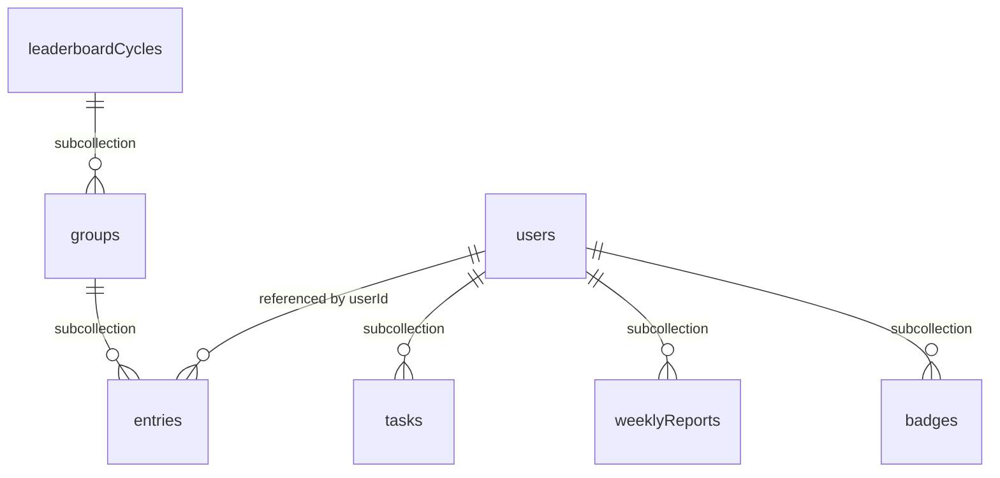

# Database Schema (Firestore)

## 1. Design Principles

- **Subcollection per user** untuk data yang scope-nya 1:1 ke satu user (task, weekly report, badge). Ini idiomatic Firestore pattern untuk owner-scoped data: security rules jadi sederhana (`request.auth.uid == userId` di path), dan tidak perlu composite index untuk filter `userId` karena sudah implisit dari path.
- **Top-level collection** hanya untuk data yang secara natural cross-user (leaderboard cycle, karena satu grup berisi 14 user berbeda).
- **`date` disimpan sebagai string ISO (`YYYY-MM-DD`)**, bukan Firestore `Timestamp`. Alasan: task terikat ke kalender tanggal di timezone user, bukan titik waktu presisi detik. Kalau pakai `Timestamp`, setiap query by "tanggal ini" perlu range query dengan konversi timezone yang rawan bug (bisa salah hari kalau timezone tidak dihandle konsisten). String `YYYY-MM-DD` membuat equality query dan range query jadi straightforward dan timezone-safe di level data.
- **Field turunan (`utcResetHour`) disimpan langsung**, bukan dihitung ulang tiap kali job jalan. Dijelaskan di Section 3.

## 2. Collections Overview

## 3. `users/{uid}`

| Field | Type | Catatan |
|---|---|---|
| `displayName` | string | |
| `email` | string | dari Firebase Auth |
| `avatarUrl` | string \| null | |
| `city` | string | hasil resolve IP geolocation, atau manual override |
| `cityManualOverride` | boolean | true kalau user pernah edit manual, dipakai supaya `weeklyCycleJob` tidak menimpa city yang sudah di-override dengan hasil IP geolocation baru |
| `timezone` | string | IANA timezone string, misal `"Asia/Jakarta"`, auto-detect saat onboarding, editable di settings |
| `utcResetHour` | number (0-23) | **derived field**, dihitung dari `timezone` saat create/update: jam UTC yang berkorespondensi dengan local midnight user. Disimpan langsung (bukan dihitung ulang tiap job run) supaya `taskCutoverJob` bisa query `where utcResetHour == currentHour` tanpa perlu load semua user dan hitung timezone satu-satu tiap jam |
| `aiReportEnabled` | boolean | default `true`, per-user toggle untuk AI-enhanced suggestion |
| `currentGroupId` | string \| null | denormalized dari `leaderboardCycles/{cycleId}/groups/{groupId}` cycle yang sedang berjalan, ditulis oleh `weeklyCycleJob` setelah fase matching selesai. Menghindari collection group query mahal saat user membuka halaman leaderboard — lihat `API.md` Section 9 |
| `createdAt` | Timestamp | |
| `updatedAt` | Timestamp | |

**Catatan `utcResetHour`**: untuk timezone dengan offset non-integer-hour (misal India UTC+5:30), granularity hourly job berarti cutover-nya bisa meleset hingga 30 menit dari midnight sebenarnya. Ini konsisten dengan keputusan di `ARCHITECTURE.md` bahwa presisi ke menit tidak dibutuhkan untuk use case ini.

## 4. `users/{uid}/tasks/{taskId}`

| Field | Type | Catatan |
|---|---|---|
| `category` | `"hustle"` \| `"humble"` | |
| `title` | string | |
| `level` | number (1-5) | tekanan (hustle) atau relaksasi (humble) |
| `durationHours` | number | desimal diperbolehkan |
| `date` | string `YYYY-MM-DD` | lihat rationale Section 1 |
| `status` | `"pending"` \| `"completed"` \| `"missed"` | |
| `score` | number \| null | null selama `pending`, diisi Cloud Function saat `completed` |
| `createdAt` | Timestamp | |
| `completedAt` | Timestamp \| null | |
| `missedAt` | Timestamp \| null | diisi oleh `taskCutoverJob` |

**Semua write ke koleksi ini lewat Cloud Function** (`createTask`, `completeTask`, `taskCutoverJob`), bukan direct client write — sesuai keputusan di `ARCHITECTURE.md` Section 4.1. Security rules hanya mengizinkan `read` untuk owner, `write` ditolak seluruhnya dari client.

**Cap validation**: saat `createTask`/`updateTask` dipanggil, Cloud Function mengecek dua threshold dari Remote Config: `perTaskDurationCapHours` (flat, default 16 jam, terhadap `durationHours` task itu sendiri) dan `dailyDurationCapHours` (default 24 jam, terhadap total durasi seluruh task di tanggal yang sama). Untuk cap harian dipakai **Firestore aggregation query (`sum()`)**, bukan fetch semua dokumen lalu jumlahkan manual di kode — jauh lebih murah dari sisi read cost karena aggregation query tidak menghitung sebagai document read penuh. Detail kontrak error di `API.md` Section 2-3.

## 5. `users/{uid}/weeklyReports/{weekId}`

`weekId` format ISO week: `"2026-W36"`.

| Field | Type | Catatan |
|---|---|---|
| `weekId` | string | redundant dengan document ID, disimpan juga sebagai field supaya bisa dipakai di collection group query kalau dibutuhkan nanti |
| `startDate` / `endDate` | string `YYYY-MM-DD` | |
| `hustleScore` / `humbleScore` / `totalScore` | number | |
| `balanceIndex` | number (0-100) | formula di `PRD.md` Section 7.2 |
| `completedTasksCount` / `missedTasksCount` | number | |
| `completionRate` | number (0-1) | |
| `ruleBasedSuggestion` | string | selalu diisi |
| `aiSuggestion` | string \| null | null kalau `aiReportEnabled == false` atau LLM call gagal |
| `generatedAt` | Timestamp | |

Ditulis oleh `weeklyCycleJob`, read-only dari sisi client.

## 6. `leaderboardCycles/{cycleId}`

`cycleId` sama dengan `weekId` (misal `"2026-W36"`) untuk konsistensi lintas koleksi.

| Field | Type | Catatan |
|---|---|---|
| `weekId` | string | |
| `startDate` / `endDate` | string | |
| `status` | `"matching"` \| `"scoring"` \| `"completed"` | tracking progress `weeklyCycleJob`, berguna untuk resume kalau job gagal di tengah jalan (lihat risk di `ARCHITECTURE.md` Section 12) |
| `createdAt` | Timestamp | |

### 6.1 `leaderboardCycles/{cycleId}/groups/{groupId}`

| Field | Type | Catatan |
|---|---|---|
| `locationLevel` | `"city"` \| `"province"` | hasil dari fallback matching (`PRD.md` Section 8.2) |
| `locationName` | string | |
| `memberCount` | number | |
| `status` | `"pending"` \| `"scored"` | |

### 6.2 `leaderboardCycles/{cycleId}/groups/{groupId}/entries/{uid}`

| Field | Type | Catatan |
|---|---|---|
| `userId` | string | redundan dari document ID, disimpan sebagai field supaya bisa di-query lewat **collection group query** (misal "cari semua entry milik user X sepanjang waktu" tanpa perlu tahu `cycleId`/`groupId`-nya) |
| `weeklyRawScore` | number | dari `weeklyReports` user bersangkutan di minggu yang sama |
| `balanceIndex` | number | |
| `completionRate` | number | |
| `balanceWeight` | number | dihitung dari `balanceIndex` pakai konstanta Remote Config |
| `completionWeight` | number | dihitung dari `completionRate` pakai konstanta Remote Config |
| `leaderboardScore` | number | `weeklyRawScore x balanceWeight x completionWeight` |
| `rank` | number \| null | diisi setelah seluruh entry di grup selesai dihitung |

## 7. `users/{uid}/badges/{badgeId}`

| Field | Type | Catatan |
|---|---|---|
| `tier` | `"gold"` \| `"silver"` \| `"bronze"` | |
| `cycleId` | string | referensi ke `leaderboardCycles` |
| `groupId` | string | |
| `locationName` | string | denormalized dari group, supaya profile page tidak perlu extra read untuk menampilkan "Gold — Jakarta, minggu ke-36" |
| `awardedAt` | Timestamp | |

## 8. Composite Indexes yang Dibutuhkan

| Collection (path) | Fields | Dipakai untuk |
|---|---|---|
| `users/{uid}/tasks` | `status ASC, date ASC` | `weeklyCycleJob` menghitung completed/missed task per minggu (filter status, range date) |
| `users` (top-level) | `utcResetHour ASC` | `taskCutoverJob` mencari user yang local midnight-nya jatuh di jam UTC berjalan |
| `entries` (collection group) | `userId ASC` | mencari riwayat leaderboard entry seorang user lintas cycle, dipakai di profile/badge history |

Index lain (single-field equality seperti `date == X` di tasks) sudah otomatis ter-cover oleh default single-field index Firestore, tidak perlu didefinisikan manual.

## 9. Security Rules Summary

Rules detail akan ditulis terpisah di `firestore.rules`, tapi prinsip yang harus dipegang saat implementasi:

- `users/{uid}`: **read** oleh owner. **Write ditolak dari client** (`allow write: if false`), seluruh update profile (termasuk `timezone`, yang butuh recompute `utcResetHour` secara konsisten) lewat callable function `updateProfile`. Ini menghindari kasus `timezone` berubah tapi `utcResetHour` tidak ikut ter-update kalau ditulis langsung dari client.
- `users/{uid}/tasks/{taskId}`: **read-only dari client**, seluruh write ditolak (`allow write: if false`). Semua mutasi lewat callable Cloud Function pakai Admin SDK.
- `users/{uid}/weeklyReports/{weekId}`: read-only dari client.
- `users/{uid}/badges/{badgeId}`: read-only dari client.
- `leaderboardCycles/**`: read **dibatasi ke member grup yang bersangkutan**, bukan seluruh authenticated user secara blanket. "Publik antar peserta dalam grup" (`PRD.md` Section 8) berarti sesama anggota grup yang sama bisa saling lihat, bukan user mana pun di seluruh aplikasi bisa query skor grup lain yang tidak diikutinya — kalau dibuka blanket, siapa pun bisa scan seluruh leaderboard nasional lintas grup, yang bukan tujuan fitur ini dan menambah luas permukaan data exposure tanpa manfaat produk yang jelas. Implementasi konkret (cek keanggotaan lewat field di dokumen `groups/{groupId}` atau dokumen `entries` itu sendiri) didetailkan saat menulis `firestore.rules` di M6/M7, bukan blocker untuk lanjut ke fase berikutnya. Write tetap ditolak seluruhnya dari client, terlepas dari keanggotaan grup.

## 10. Hal yang Sengaja Tidak Dibuat sebagai Collection Terpisah

- **Daily report**: tidak ada collection `dailyReports`. Daily report cukup dihasilkan dari query `users/{uid}/tasks where date == X` secara langsung saat halaman report dibuka — datanya sudah cukup kecil (task dalam satu hari) untuk tidak butuh precomputed cache.
- **Remote Config values** (constants weighting, daily cap): bukan Firestore document, tetap di Firebase Remote Config sesuai `ARCHITECTURE.md` Section 4.3.

## 11. Next Steps

Lanjut ke `API.md` untuk mendefinisikan kontrak callable functions (`createTask`, `completeTask`) dan bentuk response yang dikonsumsi frontend.
